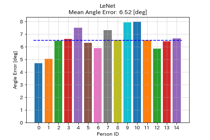

# Capstone Final Project 


# SST 

> **SST: Software for Srabismus Therapy**
> <br> Sunhee Jo, myeongmook Kang,  yewon Jeon, Joon-hee Han, Goo-yeon Kwon✉️
>
> ## Strabismus Treatment Program
> Strabismus typically develops between the ages of 2 and 5, causing each eye to focus on a different target, leading to visual confusion and double vision.
> If left untreated before the age of 9, visual function may deteriorate, making proper treatment essential.
>
> This **Strabismus Treatment Program** is designed to overcome the limitations of traditional treatment methods, enabling effective treatment solely through software.
>
> ### Key Features
> - Utilizes **gaze tracking technology** and **EasyOCR-based text detection**.
> - Provided as a simple desktop application with selectable themes such as storybooks or picture books.
>
> ### How It Works
> 1. **Select the eye(s) to treat**: Left eye, right eye, or both.
> 2. **Follow the box**: The program tracks the child’s gaze as they follow an automatically generated box around the letters on the screen.
> 3. **Real-time eye tracking**: The laptop's camera monitors the child’s eyes. When the red line enters the box on the screen, it is considered a success, and the program moves to the next step.
>
> ### Why It’s Effective
> This intuitive and engaging treatment approach allows children to undergo visual therapy in a fun and stress-free manner, making the process both effective and enjoyable.
>
> - This capstone design project was developed with the goal of treating strabismus in young children.
> - The project combines gaze tracking technology with EasyOCR-based text detection, aiming to enable treatment anytime, anywhere with a single software solution.


# 💡 Overview


# These are my modifications to the script
- functionality to map the predicted gaze vector from webcam image to the computer screen
- gridview pointer showing where the gaze is currently pointed at (adjustable pixel size)
- added landmark averaging: **AVG_LANDMARKS** over number of frames
- added gaze vector averaging: **GAZE_AVG_FLAG** over number of gaze vectors
- video playback with different scenarios such as **UPDOWN**, **LEFTRIGHT**, **STABILITY**, **SEQ**
- performance evaluation calcuation of **MAE**, **CEP** and **CE95**
- drawing functions for the results

## Calibration values
Currently it is calibrated to my personal MBP13 so this needs to be adjusted accoring to your computer:
> check **screen_conf.py** for more details

## 🛠️ Preparation 

### Requirements

* Python >= 3.7

```bash
pip install -r requirements.txt
```

### Model weights
* Landmarks: http://dlib.net/files/shape_predictor_68_face_landmarks.dat.bz2
* Eye model: https://github.com/hysts/pytorch_mpiigaze_demo/releases/download/v0.1.0/mpiigaze_resnet_preact.pth
The Landmarks dlib file needs to be unzipped and moved to **pytorch_mpiigaze/data/dlib/** folder. Move the pth files into **data/models/** -> **data/models/mpiigaze/resnet_preact/model.pth** for the eye model.

### Run the script
* eye model: configs/demo_mpiigaze_resnet.yaml
* 
   python point_2_screen.py --config configs/demo_mpiigaze_resnet.yaml --demo 1

### Download the dataset and preprocess it

##### MPIIGaze

```bash
bash scripts/download_mpiigaze_dataset.sh
python tools/preprocess_mpiigaze.py --dataset datasets/MPIIGaze -o datasets/
```

### Usage

This repository uses [YACS](https://github.com/rbgirshick/yacs) for
configuration management.
Default parameters are specified in
[`gaze_estimation/config/defaults.py`](gaze_estimation/config/defaults.py)
(which is not supposed to be modified directly).
You can overwrite those default parameters using a YAML file like
[`configs/mpiigaze/lenet_train.yaml`](configs/mpiigaze/lenet_train.yaml).


#### Training and Evaluation

By running the following code, you can train a model using all the
data except the person with ID 0, and run test on that person.

```bash
python train.py --config configs/mpiigaze/lenet_train.yaml
python evaluate.py --config configs/mpiigaze/lenet_eval.yaml
```

Using [`scripts/run_all_mpiigaze_lenet.sh`](scripts/run_all_mpiigaze_lenet.sh) and
[`scripts/run_all_mpiigaze_resnet_preact.sh`](scripts/run_all_mpiigaze_resnet_preact.sh),
you can run all training and evaluation for LeNet and ResNet-8 with
default parameters.


## 🤖 How to Run Demo 

This demo program runs gaze estimation on the video from a webcam.

1. Download the dlib pretrained model for landmark detection.

    ```bash
    bash scripts/download_dlib_model.sh
    ```
    
2. Run demo.

    Specify the model path and the path of the camera calibration results
    in the configuration file as in
    [`configs/demo_mpiigaze_resnet.yaml`](configs/demo_mpiigaze_resnet.yaml).

    ```bash
    python EyeGaze_Tracker_PyQt.py
    ```

## 🔢 Result: 
### MPIIGaze

| Model           | Mean Test Angle Error [degree] | Training Time |
|:----------------|:------------------------------:|--------------:|
| LeNet           |              6.52              |  3.5 s/epoch  |
| ResNet-preact-8 |              5.73              |   7 s/epoch   |

The training time is the value when using GTX 1080Ti.




## 📣 Demo Video:  
[](https://www.youtube.com/watch?v=argc1P7spzY)

## 🤝 Acknowledgement
We are grateful for the following awesome projects our SST arising from:
* [eyeGazeToScreen](https://github.com/kenkyusha/eyeGazeToScreen.git): modifications to the original mpiigaze_pytorch

## ✏️ References
* Zhang, Xucong, Yusuke Sugano, Mario Fritz, and Andreas Bulling. "Appearance-based Gaze Estimation in the Wild." Proc. of the IEEE Conference on Computer Vision and Pattern Recognition (CVPR), 2015. [arXiv:1504.02863](https://arxiv.org/abs/1504.02863), [Project Page](https://www.mpi-inf.mpg.de/departments/computer-vision-and-multimodal-computing/research/gaze-based-human-computer-interaction/appearance-based-gaze-estimation-in-the-wild/)
* Zhang, Xucong, Yusuke Sugano, Mario Fritz, and Andreas Bulling. "It's Written All Over Your Face: Full-Face Appearance-Based Gaze Estimation." Proc. of the IEEE Conference on Computer Vision and Pattern Recognition Workshops(CVPRW), 2017. [arXiv:1611.08860](https://arxiv.org/abs/1611.08860), [Project Page](https://www.mpi-inf.mpg.de/departments/computer-vision-and-machine-learning/research/gaze-based-human-computer-interaction/its-written-all-over-your-face-full-face-appearance-based-gaze-estimation/)
* Zhang, Xucong, Yusuke Sugano, Mario Fritz, and Andreas Bulling. "MPIIGaze: Real-World Dataset and Deep Appearance-Based Gaze Estimation." IEEE transactions on pattern analysis and machine intelligence 41 (2017). [arXiv:1711.09017](https://arxiv.org/abs/1711.09017)


